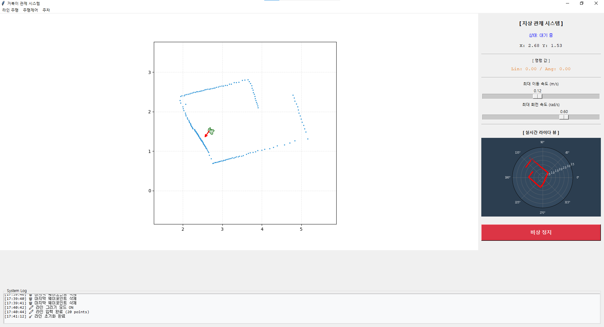
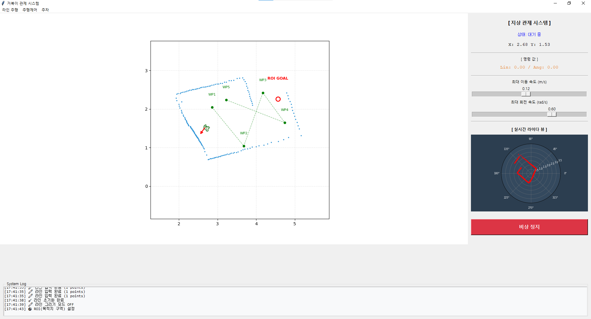
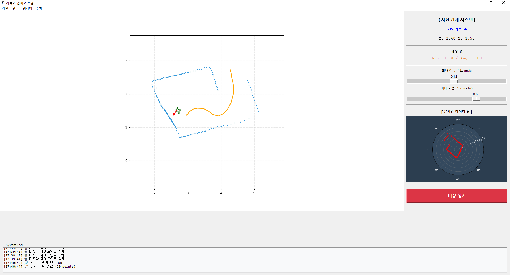
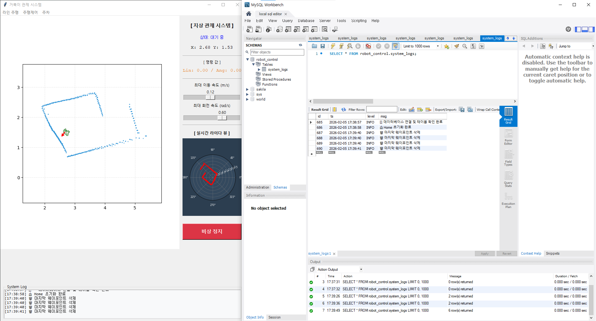

# 🐢 ROS TurtleBot 지상 관제 시스템

부트캠프 4인 팀 프로젝트 (2026.01.29 ~ 02.04)

tkinter + matplotlib 기반 실시간 관제 GUI로 TurtleBot을 제어하는 지상 관제 시스템입니다.

---

## 📸 스크린샷






---

## ✨ 주요 기능

| 기능 | 설명 |
|------|------|
| 실시간 라이다 시각화 | 극좌표계 기반 라이다 포인트클라우드 실시간 렌더링 |
| 이동 경로 표시 | 로봇 이동 궤적을 matplotlib으로 실시간 표시 |
| 웨이포인트 주행 | 맵 클릭으로 WP 설정, 순서대로 자율 주행 |
| ROI 구역 탐색 | 더블클릭으로 목적지 구역 설정 후 이동 및 벽 타기 탐색 |
| 라인 주행 | 드래그로 경로를 직접 그리면 해당 경로 따라 주행 |
| 장애물 회피 | 전방 70도 감지 + 척력 기반 동적 회피 지점 생성 |
| 전진/후진 주차 | Home 위치로 정밀 복귀 (오차 5mm 이내) |
| MySQL 로그 저장 | Queue + Worker 스레드 비동기 방식으로 이벤트 로그 DB 저장 |

---

## 🛠 기술 스택

- **언어**: Python 3.8
- **GUI**: tkinter, matplotlib (FigureCanvasTkAgg)
- **통신**: requests (HTTP, Session 재사용)
- **DB**: MySQL 8.0, pymysql
- **기타**: numpy, threading, queue

---

## 👥 팀 역할 분담

| 이름 | 담당 |
|------|------|
| 팀원1 | ROI 구역 탐색 |
| 김다은 | 이동 경로 시각화, DB 서버, MySQL DB 설계 및 비동기 로그 저장 |
| 팀원2 | 웨이포인트 주행, 원격 복귀/주차, 이동 로그 |
| 팀원3 | 라이다 센서 시각화 |
| 공동 | GUI 레이아웃 |

---

## ⚙️ 실행 방법

### 1. 의존성 설치
```bash
pip install tkinter matplotlib numpy requests pymysql
```

### 2. 설정 변경
`main.py` 상단에서 환경에 맞게 수정:
```python
MYSQL_HOST = "127.0.0.1"       # MySQL 서버 IP
URL = "http://YOUR_ROBOT_IP:4800/control"  # 로봇 서버 주소
```

### 3. 실행
```bash
python main.py
```

---

## 📁 파일 구조
```text
ros-turtle-control/
├── main.py          # 메인 관제 시스템
├── screenshots/     # 스크린샷
└── README.md
```
---

## 📝 개발 환경

- Ubuntu 20.04 (WSL2)
- ROS Noetic
- Python 3.8
- MySQL 8.0
